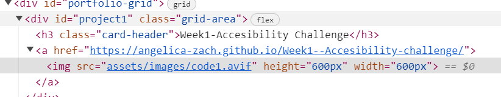
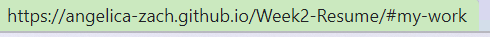

# Week2-Resume
## Description
In this project, i created a website to show off my design resume . This is the best format for my resume as potential employers can easily view my work (which also includes the page i just set up) by clicking links , as well as easy links to contact me , and can see physical evidence of my skills.
https://angelica-zach.github.io/Week2-Resume/
## Installation
(please dont this is my portfolio 😆)
Press the green  code button in the top right of the screen and copy your desired method (eg. for shh keys copy and use git clone in your terminal)

## Functions

code showing how links are implemented in the pictures

picture showing that nav section is linked to rest of page
## License
MIT License

Copyright (c) [2023] [angelica zachowski]

Permission is hereby granted, free of charge, to any person obtaining a copy
of this software and associated documentation files (the "Software"), to deal
in the Software without restriction, including without limitation the rights
to use, copy, modify, merge, publish, distribute, sublicense, and/or sell
copies of the Software, and to permit persons to whom the Software is
furnished to do so, subject to the following conditions:

The above copyright notice and this permission notice shall be included in all
copies or substantial portions of the Software.

THE SOFTWARE IS PROVIDED "AS IS", WITHOUT WARRANTY OF ANY KIND, EXPRESS OR
IMPLIED, INCLUDING BUT NOT LIMITED TO THE WARRANTIES OF MERCHANTABILITY,
FITNESS FOR A PARTICULAR PURPOSE AND NONINFRINGEMENT. IN NO EVENT SHALL THE
AUTHORS OR COPYRIGHT HOLDERS BE LIABLE FOR ANY CLAIM, DAMAGES OR OTHER
LIABILITY, WHETHER IN AN ACTION OF CONTRACT, TORT OR OTHERWISE, ARISING FROM,
OUT OF OR IN CONNECTION WITH THE SOFTWARE OR THE USE OR OTHER DEALINGS IN THE
SOFTWARE.
